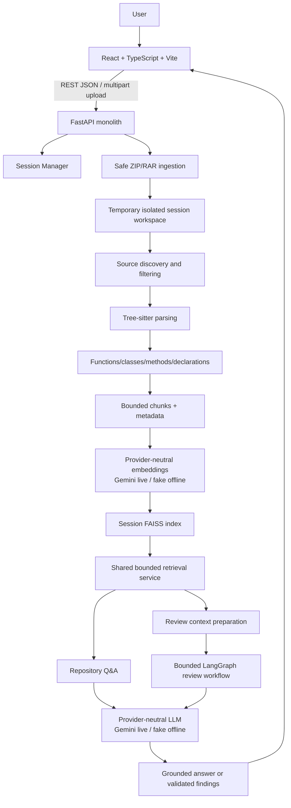
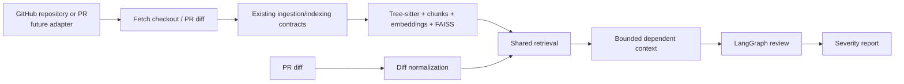
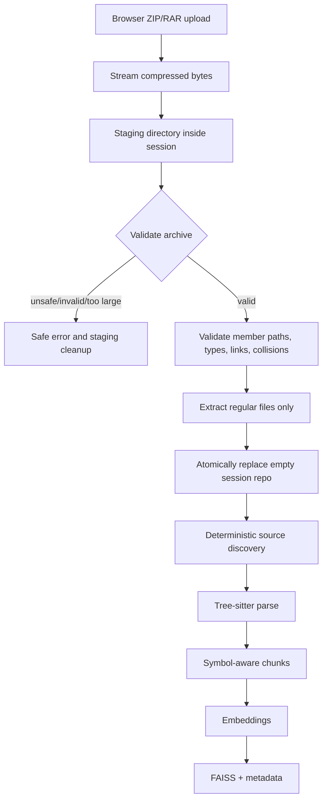
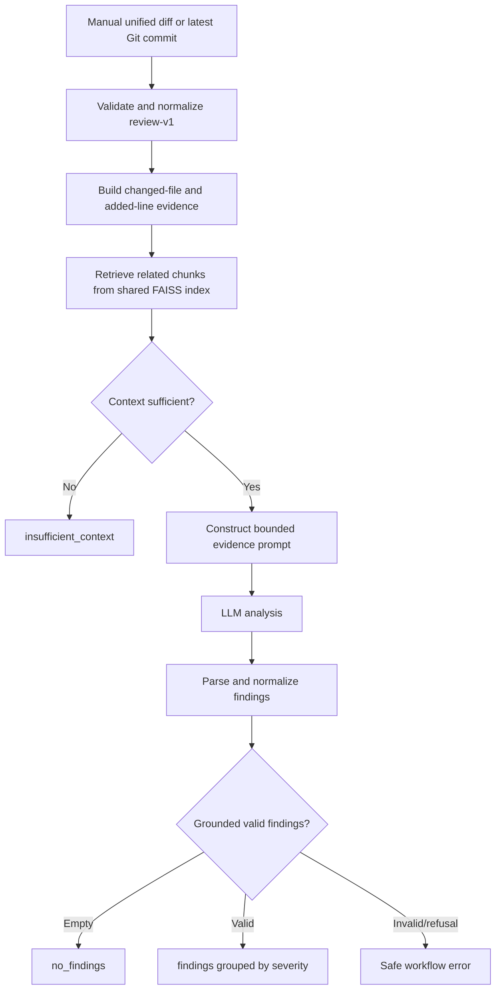
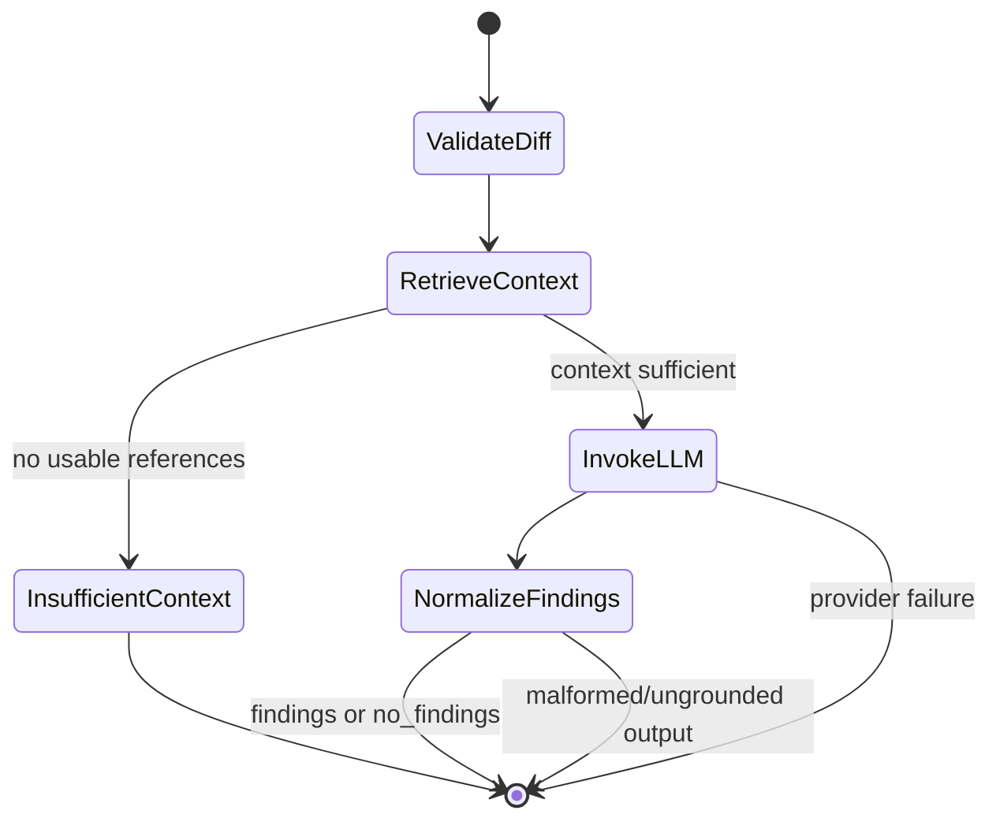
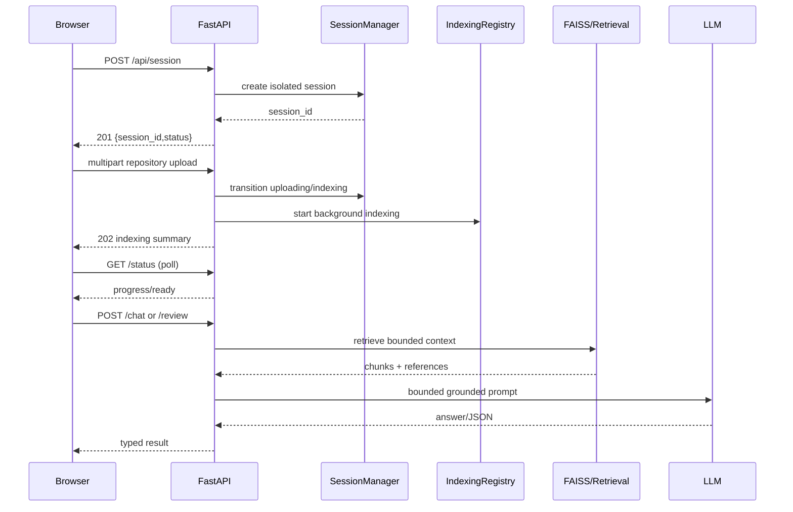
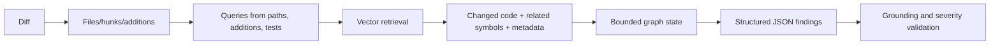
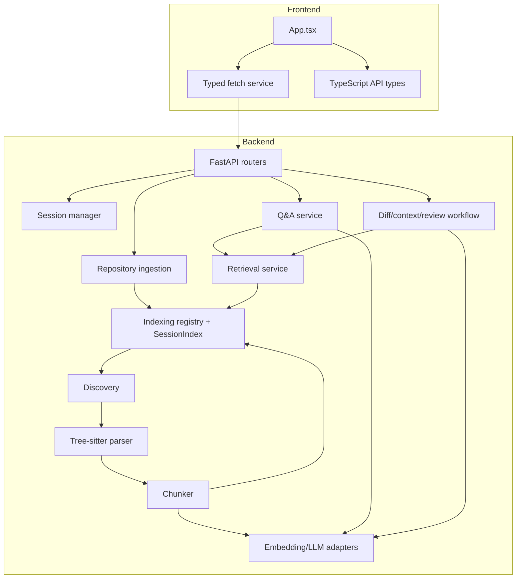
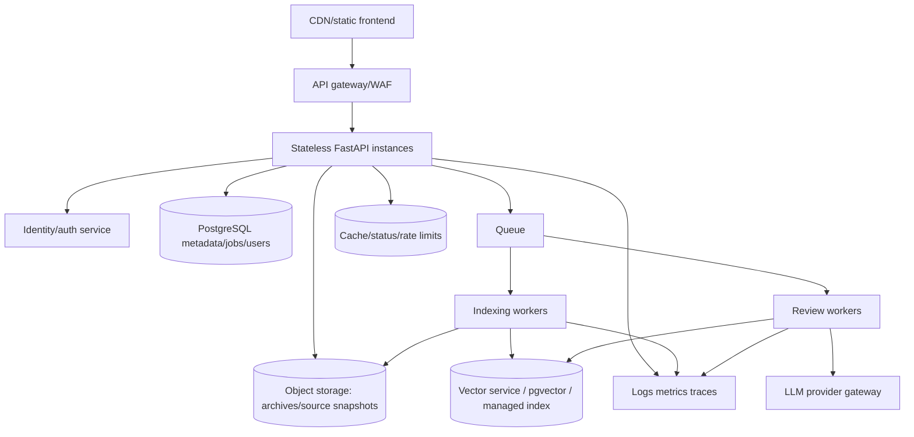

# CodeLens Interview Notes

## Implementation Assumptions

These notes are grounded in the repository, `SPEC.md`, `README.md`, and `docs/api-contract.md`.

- **Confirmed from code:** the current repository implements a local ZIP/RAR upload workflow, temporary sessions, Tree-sitter parsing, symbol-aware chunking, provider-neutral embeddings/LLM adapters, FAISS-backed retrieval, REST APIs, Q&A, manual/latest-commit review, and a bounded LangGraph review workflow.
- **Confirmed from SPEC/API contract:** the V1 system is local-repository based, session based, temporary, single-backend, database-free, and does not execute repository code. GitHub retrieval is explicitly deferred to the final phase.
- **[ASSUMED IMPLEMENTATION — based on resume/SPEC.md]:** interview questions may describe the intended mature architecture in which a GitHub repository/PR is used as an input. In the current V1, the equivalent source is a local archive and a local unified diff or latest Git commit. Describe GitHub ingestion as a **future adapter that reuses the existing ingestion/indexing pipeline**, not as a current V1 capability.
- **[ASSUMED IMPLEMENTATION — based on resume/SPEC.md]:** dependency-aware retrieval is explained as bounded retrieval of related callers/callees, imports, tests, and surrounding symbols. The current contract explicitly supports related repository context through the shared index; it does not require a separate dependency database or a full static call graph.
- The configured live provider is **Google Gemini behind provider-neutral interfaces**. Credential-free tests use deterministic fake providers. Do not claim that OpenAI is the live provider.
- Do not claim authentication, persistent accounts, PostgreSQL, Redis, microservices, Kubernetes, automatic patch application, or repository-code execution in V1.

---

# 1. Project Overview

## 30-second answer

> CodeLens is a temporary, session-based repository intelligence and code-review tool. A user uploads a local ZIP or RAR repository, the FastAPI backend safely extracts it, parses supported source files with Tree-sitter, converts functions, classes, methods, and file-level declarations into metadata-rich chunks, embeds them, and stores them in a session-scoped FAISS index. The user can then ask grounded repository questions or submit a unified diff for review. Both capabilities reuse the same retrieval service, and the review path uses a bounded LangGraph workflow to produce validated severity-based findings.

## 60-second answer

> The core problem was that an LLM cannot reliably review a repository from only a small PR diff, and sending an entire repository into a prompt is expensive and noisy. CodeLens creates a searchable semantic representation of the repository first. The upload is treated as untrusted data: archives are validated against path, size, file-count, and link restrictions, then stored in an isolated temporary session. Source discovery filters generated, vendor, binary, unsupported, and oversized files. Tree-sitter identifies meaningful declarations and preserves file, symbol, language, and line metadata. Oversized symbols are deterministically split into bounded fragments. Embeddings go into one session FAISS index with a mapping back to chunk metadata. Q&A retrieves top-k chunks and asks a provider-neutral LLM to answer only from bounded context. Code review normalizes a manual diff or latest commit, retrieves related context from the same index, and runs validation, retrieval, context-sufficiency routing, LLM invocation, and finding normalization in LangGraph.

## 2-minute answer

> CodeLens has three important boundaries: ingestion, retrieval, and reasoning. At ingestion, the browser sends a ZIP or RAR archive rather than a server filesystem path. FastAPI creates a temporary session and stages the archive before atomically replacing the repository directory. It rejects traversal paths, absolute paths, symlinks, special files, collisions, malformed archives, and resource-limit violations. Then discovery identifies supported UTF-8 source files while ignoring `.git` for indexing and common generated/dependency directories such as `node_modules`, `dist`, `build`, `.venv`, and `__pycache__`.
>
> The parser uses Tree-sitter grammars rather than regex. It walks syntax trees and emits symbols such as classes, functions, methods, interfaces, and other supported declarations. Each symbol has a repository-relative path, name, type, language, source, and one-based inclusive line range. The chunker keeps small symbols intact and splits large symbols by source lines with bounded overlap. It generates deterministic versioned SHA-256 chunk IDs. The index embeds chunks and stores FAISS plus metadata in the temporary session workspace.
>
> For Q&A, the question becomes a query embedding, FAISS returns bounded top-k results, the retrieval service deduplicates chunks and limits context characters, and the LLM receives the question, formatted evidence, and source references. For review, the diff parser validates changed files, hunks, and additions. Context preparation creates bounded queries from changed paths, additions, hunk ranges, and test hints, then retrieves related chunks. LangGraph validates the diff, retrieves context, branches to an insufficient-context outcome when appropriate, invokes the LLM only with grounded evidence, and validates the structured findings. Findings must refer to changed repository-relative files and positive new-file lines. CodeLens never executes repository code or applies patches.

## 5-minute deep explanation

The architecture deliberately optimizes for a defensible fresher-level project rather than production-scale infrastructure.

1. **Client:** React + TypeScript + Vite provides session creation, archive upload, indexing progress, Q&A, and review rendering. The UI uses REST calls and one-second status polling; WebSockets are not required.
2. **Session boundary:** `POST /api/session` creates an unpredictable session ID and temporary `repo/`, `index/`, and `metadata/` directories. Session state moves through `created → uploading → indexing → ready`, or `failed`, and finally `deleted`. A deleted session cannot publish a later indexing result.
3. **Safe repository input:** the upload endpoint accepts `multipart/form-data` under the `repository` field. It streams the compressed upload with a limit, validates ZIP/RAR members, rejects unsafe paths and non-regular entries, enforces extraction limits, and extracts into a staging directory. Only after validation succeeds does it replace the empty session repository.
4. **Discovery:** discovery creates a deterministic relative-path inventory of supported source files. It never imports or executes code. It filters ignored directories, binary/non-UTF-8 files, unreadable files, oversized files, and unsupported extensions.
5. **Parsing:** Tree-sitter creates a grammar-specific syntax tree. The parser walks declaration node types for Python, JavaScript, TypeScript, Java, Go, Rust, C/C++, C#, Ruby, PHP, Swift, and Kotlin. It records nested declarations, syntax diagnostics, and file-level fallback symbols where a source file has no meaningful declaration.
6. **Chunking:** symbol-aware chunks are better retrieval units than arbitrary character windows because a function or class usually represents one coherent behavior. Large symbols are split by source lines with overlap. Every chunk carries a stable ID and metadata including path, symbol, type, language, chunk line range, parent line range, and fragment information.
7. **Indexing:** the embedding provider is selected by configuration. Gemini is the configured live provider; a deterministic fake provider supports offline checks. FAISS stores vectors temporarily. Metadata is kept alongside the index so a returned vector position can be mapped back to a `CodeChunk`.
8. **Shared retrieval:** Q&A and review use one `RetrievalService` and one `SessionIndex`. It validates query length and top-k, searches only a ready index, deduplicates chunk IDs, truncates oversized chunks, enforces a total context limit, and formats source references.
9. **Q&A:** the provider-neutral LLM receives bounded repository evidence, not the full repository. If no useful chunks exist, the API returns HTTP 200 with `insufficient_context: true` rather than hallucinating.
10. **Review:** a manual unified diff or read-only latest commit is normalized to the same review-v1 representation. Review context retains changed lines and adds related indexed evidence. LangGraph then performs bounded state transitions and validates the response. It does not become a multi-agent system.
11. **Output:** the UI displays references for Q&A and groups findings by `critical`, `high`, `medium`, `low`, or `info`. Review suggestions are advisory only.

The strongest design sentence is:

> CodeLens indexes a repository once into meaningful, metadata-rich code units, reuses one bounded semantic retrieval service for Q&A and review, and uses a stateful validation workflow to keep LLM output grounded and safe.

## Tell me about your project

> I built CodeLens to understand how an AI system can answer questions about real source code and review changes without blindly sending an entire repository to an LLM. The user starts a temporary session and uploads a local ZIP or RAR repository. The backend validates the archive as untrusted input, discovers supported source files, and parses them with Tree-sitter. Instead of fixed arbitrary chunks, I preserve functions, classes, methods, and source locations, splitting only oversized symbols. I generate embeddings and build one FAISS index for that session, with metadata mapping each vector back to a repository-relative path, symbol, and line range.
>
> The same index powers two features. For repository Q&A, I embed the question, retrieve bounded top-k chunks, and send only that evidence to a provider-neutral Gemini-backed LLM. For code review, I accept either a manual unified diff or the latest local Git commit, validate and normalize the diff, retrieve related repository context, and run a bounded LangGraph workflow. The graph validates the diff, checks whether context is sufficient, invokes the LLM, and validates that findings point to changed new-file lines. I intentionally kept the V1 simple: no database, no microservices, no code execution, no automatic patching, and no GitHub retrieval yet. GitHub/PR ingestion is a future adapter that can reuse the same pipeline.

---

# 2. Resume Bullet Breakdown

## Bullet 1

> Built a full-stack AI chatbot and code review platform using React/TypeScript, FastAPI, Tree-sitter & FAISS for GitHub repository ingestion, code parsing, semantic code understanding and automated code analysis.

### Phrase-by-phrase interpretation

| Phrase | CodeLens meaning |
|---|---|
| **Full-stack** | React/TypeScript browser client plus Python/FastAPI server and AI/indexing services. |
| **AI chatbot** | Session-scoped repository Q&A grounded in retrieved code. |
| **Code review platform** | Manual unified-diff or latest-commit review with structured findings. |
| **React/TypeScript** | Component UI, typed API contracts, loading/error states, source references, findings. |
| **FastAPI** | REST routes, validation, CORS, exception translation, session and workflow orchestration. |
| **Tree-sitter** | Grammar-based parsing into syntax nodes and meaningful symbols. |
| **FAISS** | Temporary vector similarity index for one active session. |
| **Repository ingestion** | Current V1 means safe local ZIP/RAR ingestion; GitHub is deferred. |
| **Semantic code understanding** | Representing code units as embeddings and retrieving by meaning, not only exact words. |
| **Automated code analysis** | Bounded LLM-assisted review, not arbitrary code execution or automatic patching. |

### Engineering problem solved

A repository contains too much code for a single prompt, and source files have structure that plain text chunking loses. CodeLens creates a safe, searchable, code-aware representation and exposes useful developer workflows over it.

### Likely Question
**What did you personally build?**

### Strong Answer
I built the end-to-end workflow: session APIs, safe archive ingestion, source discovery, Tree-sitter parsing, symbol-aware chunking, embedding/indexing orchestration, shared retrieval, Q&A, review normalization, LangGraph review orchestration, and the React UI that consumes those APIs. The key integration decision was to use one session index and one retrieval service for both Q&A and review rather than duplicating pipelines.

### Possible Follow-up
**Why do you call it GitHub repository ingestion if V1 accepts local archives?**

### Follow-up Answer
The current implemented V1 is local-repository based. GitHub retrieval is explicitly deferred. The resume phrase describes the intended final adapter: fetch a repository or PR diff, place it behind the same repository ingestion and indexing contracts, and reuse the existing parser, chunker, FAISS index, retrieval service, and review graph. I would be precise in an interview rather than claiming GitHub API integration exists in V1.

### Deeper follow-ups

- **Why Tree-sitter instead of regex?** Regex cannot reliably handle nesting, comments, strings, language syntax, or multiline declarations. Tree-sitter gives grammar-aware nodes and source ranges.
- **Why FAISS instead of a database?** V1 needs temporary per-session similarity search, not durable records, users, history, or transactional metadata. FAISS avoids unnecessary infrastructure.
- **How did you keep the LLM grounded?** Bounded retrieval, explicit evidence-only prompts, source metadata, insufficient-context branching, structured output validation, and changed-line grounding.
- **What does full-stack mean beyond two folders?** The browser validates user interactions and renders state; FastAPI owns lifecycle and validation; the indexing and AI services provide the domain behavior; stable JSON contracts connect them.

## Bullet 2

> Implemented RAG with function/class-based chunking, embeddings and semantic retrieval, retrieving relevant repository context and combining it with PR diffs and dependent code for context-aware analysis of any PR.

### Phrase-by-phrase interpretation

- **RAG:** retrieve relevant repository evidence before generation.
- **Function/class-based chunking:** use syntax-aware symbols as primary chunk boundaries.
- **Embeddings:** map code and queries into vectors in a shared semantic space.
- **Semantic retrieval:** use vector similarity to retrieve meaning-related code.
- **Repository context:** existing implementation, related symbols, metadata, and possibly tests.
- **PR diff:** added/removed/modified lines and changed-file/hunk structure.
- **Dependent code:** bounded related callers, callees, imports, classes, or tests.
- **Context-aware analysis:** judge a change in relation to the existing implementation rather than in isolation.

### Likely Question
**Why not send only the PR diff to the LLM?**

### Strong Answer
A diff tells me what changed but usually not what the changed code assumes. A modified function may call a helper, rely on a class invariant, use a configuration value, or need a test. I retain the diff as primary evidence and retrieve related repository chunks from the existing session index. This gives the model enough context without putting the entire repository into the prompt.

### Possible Follow-up
**Why function/class-based chunks instead of 500-token chunks?**

### Follow-up Answer
Code has semantic boundaries. A function, method, or class is usually a coherent unit, and its file/symbol/line metadata makes the result explainable. Fixed windows can split a function at a random point and mix unrelated logic. I still bound chunk size: oversized symbols are split by source lines with bounded overlap and retain parent-symbol and fragment metadata.

### Deeper follow-ups

- **What metadata did you preserve?** `chunk_id`, relative path, symbol name/type, language, source, chunk start/end lines, parent symbol lines, fragment index/count, and retrieval score.
- **How did you choose top-k?** Use a configurable bounded default, currently default 8 and maximum 20 in the retrieval service, then apply a total context character limit and deduplication. Top-k is a quality/latency/context tradeoff, not a magic number.
- **What if relevant code is not retrieved?** Return an insufficient-context outcome where retrieval has no evidence; improve chunking, embedding model, query construction, filters, reranking, or dependency expansion rather than asking the LLM to guess.
- **Why not fine-tune?** Repository contents change frequently, and the task requires current source evidence and citations. RAG updates by reindexing; fine-tuning is less suitable for per-repository freshness.

## Bullet 3

> Built a LangGraph pipeline to analyze PRs, evaluate code changes and generate severity-based review reports.

### Phrase-by-phrase interpretation

- **LangGraph pipeline:** a bounded directed state workflow, not an unconstrained autonomous agent.
- **Analyze PRs:** parse and validate diff evidence, identify changed files/lines, and collect related context.
- **Evaluate code changes:** ask the LLM to reason about correctness, risk, and categories using grounded evidence.
- **Severity-based report:** normalize findings into a schema with severity, location, issue, explanation, optional fix/category/confidence.

### Likely Question
**Why did you use LangGraph instead of a normal function chain?**

### Strong Answer
The review flow has explicit state and a meaningful branch: if retrieval produces no usable context, the system must return `insufficient_context` without invoking the LLM. It also has distinct validation, retrieval, generation, and normalization stages with safe failure boundaries. LangGraph makes those transitions explicit and extensible while remaining a single bounded workflow. It is not used to create multiple agents or to execute repository code.

### Possible Follow-up
**What state flows through the graph?**

### Follow-up Answer
The state contains the raw diff, normalized `ReviewInput`, bounded `ReviewContext`, provider response text, terminal `ReviewResult`, and safe workflow errors. The validate node creates the normalized diff; retrieve builds shared-index context; a conditional route chooses insufficient-context or invoke; invoke calls the provider with a bounded prompt; normalize parses JSON and grounds findings to changed files and added lines.

### Deeper follow-ups

- **What are the terminal outcomes?** `findings`, `no_findings`, and `insufficient_context`; provider/validation failures become safe API errors.
- **How do you prevent hallucinated locations?** Every finding must use a changed repository-relative file and a positive new-file line represented by an addition in the diff.
- **What happens when the LLM returns malformed JSON?** Normalization raises a safe `MALFORMED_LLM_OUTPUT` workflow error; raw output, prompts, and secrets are not exposed.
- **Can the graph apply patches?** No. It only returns advisory findings. Repository code is never executed and patches are never applied.

---

# 3. Complete System Architecture

## Current V1 architecture



## Intended GitHub/PR extension



**Interview precision:** GitHub is not part of current V1. The future adapter should not create a second architecture.

## Repository ingestion pipeline



## RAG pipeline

```mermaid
flowchart LR
    Q[User question or review query] --> QE[Query embedding]
    QE --> FS[FAISS similarity search]
    FS --> TOP[Top-k candidate chunks]
    TOP --> DEDUP[Deduplicate and apply context limits]
    DEDUP --> CTX[Evidence + source metadata]
    CTX --> PROMPT[Bounded prompt]
    PROMPT --> MODEL[Provider-neutral LLM]
    MODEL --> ANS[Answer or structured review JSON]
```



## PR review pipeline



## LangGraph state/workflow



## Request/response flow



## PR data flow



## Component architecture



---

# 4. End-to-End Execution Flow

## Scenario A: repository question

1. The browser creates a session with `POST /api/session`.
2. FastAPI creates an unpredictable session ID and isolated temporary directories.
3. The user selects a ZIP or RAR archive. The browser sends it as the `repository` multipart field; it never sends an arbitrary server path.
4. The backend streams the upload to staging and checks compressed size.
5. ZIP/RAR members are checked for traversal, absolute paths, NULs, collisions, symlinks, special files, nesting, file size, extracted size, and file count.
6. Validated content is atomically moved into the session repository. Failed validation removes staging data.
7. The upload returns `202` with `indexing`. A background indexing task runs discovery, parsing, chunking, embeddings, and FAISS construction.
8. The frontend polls the status endpoint until `ready` or `failed`.
9. Discovery filters unsupported, ignored, binary, unreadable, empty, and oversized files.
10. Tree-sitter parses each source file. Syntax problems become diagnostics; one bad file does not necessarily abort the repository.
11. Symbols become bounded chunks with stable IDs and source metadata.
12. Embeddings are generated through the configured provider and added to the session FAISS index. Metadata maps vector results to source chunks.
13. The user submits `POST /api/session/{id}/chat` with a question of 1–4,000 characters.
14. The retrieval service validates the question, searches the ready index, deduplicates results, limits top-k/chunk/context size, and formats evidence.
15. The Q&A prompt tells the LLM to use retrieved evidence. It receives the question, code, metadata, and not the whole repository.
16. The response returns an answer, references, and `insufficient_context`.
17. The UI renders the answer and repository-relative file/symbol/line references.

## Scenario B: local PR/code review

1. The user selects manual diff or latest local Git commit.
2. For manual review, the browser sends `{source:"manual", diff:"..."}`. For latest commit it sends `{source:"last_commit"}`.
3. Latest-commit review uses fixed, read-only Git commands in the session repository; it never applies a patch or executes hooks.
4. The workflow parses the unified diff into files, hunks, line kinds, and new-file line numbers.
5. It rejects blank, malformed, oversized, unsafe, or inconsistent diffs.
6. Review context creates bounded queries from changed paths, additions, hunk ranges, and related-test hints.
7. The same session FAISS index retrieves related symbols and returns metadata-rich context. No second index is created.
8. Changed diff evidence is retained even if retrieval returns no matching chunks.
9. LangGraph routes to `insufficient_context` if there are no usable references; the LLM is not called in that branch.
10. Otherwise, the graph constructs a bounded prompt containing the diff evidence, related code, and references. Repository text is treated as evidence, not instructions.
11. The provider-neutral LLM returns JSON with a `findings` array.
12. The normalize node parses JSON, validates severity and fields, and ensures each finding points to a changed repository-relative file and an added new-file line.
13. Empty valid findings become `no_findings`; valid findings become `findings`; invalid JSON, refusals, ungrounded findings, or provider errors become safe errors.
14. The UI groups findings by critical/high/medium/low/info and displays location, explanation, optional suggestion, category, and confidence.
15. CodeLens does not modify the repository.

---

# 5. Frontend — React + TypeScript

## Why React?

React fits a stateful workflow with independent UI regions: session controls, upload/progress, Q&A, and review. Components re-render when session status, answers, or findings change. It avoids building a custom DOM update system.

## Why TypeScript?

The API has multiple discriminated values: session states, review sources, review outcomes, and severity levels. TypeScript catches mismatches such as rendering a finding without a required file or sending an invalid review source. Interfaces mirror the backend contract while keeping UI code readable.

## Component/state architecture

The current UI is intentionally small and can be described as one composition root with logical panels:

- **Session panel:** create/end/retry session, select ZIP/RAR, upload.
- **Progress panel:** status, progress, indexed files, warnings.
- **Q&A panel:** question textarea, async state, answer history, references.
- **Review panel:** manual/latest-commit source, diff input, review result, severity groups.
- **API service:** typed `fetch` wrapper, timeout handling, safe `ApiError` conversion.
- **Types:** `SessionResponse`, `IndexingStatus`, `ChatResponse`, `ReviewResponse`, and finding/severity unions.

State is local React state rather than a global store because V1 has one active browser session. Important states include `created`, `uploading`, `indexing`, `ready`, `failed`, and `deleted`. Polling uses a timeout ref and is stopped on unmount, deletion, failure, or session expiration.

## API communication

- `createSession()` → `POST /api/session`
- `uploadRepository()` → multipart `POST /api/session/{id}/repository`
- `getIndexingStatus()` → `GET /api/session/{id}/status`
- `askQuestion()` → JSON `POST /api/session/{id}/chat`
- `submitReview()` → JSON `POST /api/session/{id}/review`
- `deleteSession()` → `DELETE /api/session/{id}`

The fetch wrapper uses `AbortController` with a 10-second browser request timeout, parses the documented error shape, and turns failures into `ApiError(status, code, message)`.

## Loading/error handling

The UI disables conflicting controls while requests are active, shows accessible `role="status"`/`aria-live` messages, distinguishes session expiry from ordinary network errors, clears stale Q&A/review state when a session ends, and explicitly renders insufficient context rather than pretending it is a successful grounded answer.

## Frontend interview levels

### 🟢 LEVEL 1 — Basic

**Q: Why use TypeScript in a React application?**  
A: It gives compile-time checks for props, API responses, unions, and event handling, reducing runtime contract mistakes.

**Q: What is component state?**  
A: State is data owned by a component that triggers a re-render when it changes. CodeLens uses it for session status, selected archive, question, async flags, and results.

**Q: How does the frontend call FastAPI?**  
A: It uses browser `fetch` over REST. Upload uses `FormData`; chat and review use JSON.

### 🟡 LEVEL 2 — Implementation

**Q: Why poll indexing instead of blocking the upload request?**  
A: Parsing and embedding can take longer than a normal request. The upload can acknowledge acceptance with `202`, while the UI polls status and remains responsive.

**Q: How do you prevent stale polling?**  
A: Store the timeout ID in a ref, clear it when status is terminal, on cleanup, and when a session is deleted or expired. A ref to the latest callback avoids stale closure behavior.

**Q: How do you represent API errors?**  
A: The service parses `{error:{code,message}}` and throws a typed `ApiError`, so UI code can distinguish 404/410 expiration, timeout, and application failures.

### 🔴 LEVEL 3 — Deep/follow-up

**Q: How would you prevent duplicate review submissions?**  
A: Disable the form while `reviewing`, reject concurrent requests server-side if needed, and use a request ID/idempotency strategy if the operation later becomes asynchronous.

**Q: How would you scale the frontend?**  
A: Split panels into components, introduce a query/cache library only when multiple screens need shared server state, virtualize large answer/finding lists, and keep the API types generated or centrally maintained.

**Q: How would you handle a browser refresh?**  
A: V1 intentionally keeps active state in memory. A future design could store a session ID in session storage, but it must handle the server session being deleted and must not persist repository content in browser storage.

---

# 6. Backend — FastAPI

## Why FastAPI?

FastAPI provides typed request validation through Pydantic, automatic OpenAPI documentation, straightforward routing, async upload handling, and good Python integration. It is lighter than Django for a focused API and more structured than a minimal Flask application for this contract-heavy service.

## API/lifecycle design

- Application creates settings, CORS middleware, session manager, indexing registry, and exception handlers.
- Routers separate session, repository, indexing, chat, and review concerns.
- Request models validate lengths and mutually exclusive review source fields.
- Exceptions are translated into stable safe JSON without absolute paths, prompts, provider output, stderr, or secrets.
- `BackgroundTasks` starts indexing after the upload returns.
- A thread-safe registry tracks statuses and indexes.

## Async versus sync

The upload endpoint is async because it streams `UploadFile` reads without blocking the event loop during request I/O. The indexing pipeline is CPU/provider/file work executed as a background task in the current MVP. A production design would move long indexing and embedding jobs into workers/queues. Async does not make CPU-heavy Tree-sitter parsing or FAISS operations magically parallel; it mainly helps with I/O concurrency.

## Status codes

- `200`: health, chat success, review success, status.
- `201`: session created.
- `202`: repository accepted and indexing started.
- `404`: unknown session.
- `409`: session not ready or invalid lifecycle state.
- `410`: deleted session.
- `413`: upload/extraction/resource limit.
- `422`: invalid question/diff/Git source.
- `502`: provider or Git command failure.
- `500`: safe internal workflow failure.

## Backend questions

**Q: FastAPI versus Flask?**  
A: FastAPI gives Pydantic validation, type-driven OpenAPI, and a natural async upload path. Flask could work, but I would manually assemble more validation and documentation.

**Q: FastAPI versus Django?**  
A: Django is valuable for ORM, authentication, admin, and a larger web platform. V1 intentionally has no persistent database/accounts, so its conventions would be unnecessary overhead.

**Q: What happens with multiple users?**  
A: Each request carries a session ID and the manager creates an isolated workspace. The registry is lock-protected. The MVP is single-process/session-oriented; production would externalize job state and indexes.

**Q: How would you scale it?**  
A: Make API instances stateless, put indexing/embedding/review jobs on a queue, store repositories and metadata in object storage/database, use a durable vector service, add rate limits, and persist job status. Keep request handlers thin.

**Q: What is the main bottleneck?**  
A: Embedding calls and LLM latency usually dominate; for large repositories, archive I/O, parsing, memory, and index construction also matter.

**Q: How would you handle GitHub API failure?**  
A: In the future adapter, use bounded timeouts, retry only transient failures with backoff, respect rate-limit headers, return a safe provider/source error, and leave the session in a clear failed state. Do not expose tokens or raw response bodies.

**Q: How would you authenticate users?**  
A: Authentication is not in V1. A production version could use an OAuth provider, validate session ownership on every request, and authorize GitHub token scopes per repository. I would not claim this exists today.

---

# 7. GitHub Repository Ingestion

## Current versus intended

Current V1 accepts local ZIP/RAR archives. GitHub URL retrieval, GitHub API authentication, PR metadata retrieval, and direct GitHub PR review are deferred. The important architectural answer is that the future GitHub adapter should produce the same repository workspace and diff contracts used today.

## Current local ingestion

1. Receive archive as multipart `repository`.
2. Stream it to a session-local staging directory.
3. Validate extension and archive structure.
4. Normalize member names to relative POSIX paths.
5. Reject traversal, absolute paths, NULs, collisions, symlinks, special entries, and limits.
6. Preserve `.git` when present for read-only latest-commit review, while discovery excludes it from source indexing.
7. Extract regular files only.
8. Atomically replace the empty `repo/` directory.
9. Discover supported source files deterministically.

## Future GitHub adapter

[ASSUMED IMPLEMENTATION — based on resume/SPEC.md]

- Parse owner/repository/ref/PR identifiers from a validated URL.
- Fetch a specific repository revision into an isolated workspace, preferably through a provider client or shallow checkout rather than unconstrained cloning.
- Fetch PR metadata and unified diff.
- Apply the same size, path, file, and timeout limits.
- Pass the checkout to the existing discovery → parse → chunk → embed → FAISS pipeline.
- Pass the diff to the existing review normalization and LangGraph workflow.
- Never execute repository hooks/builds.

## Interview questions

**How do you avoid `node_modules`?**  
Discovery ignores common vendor/generated/cache directories and reports skip counts. The archive transport may preserve files, but they are not indexed.

**How do you handle a monorepo?**  
Treat it as one bounded workspace, apply file and byte limits, preserve relative paths, and optionally add package-root metadata or user-selected subdirectory filters. Do not index generated/vendor trees.

**How do you handle binary files?**  
Skip them during discovery. Parse only supported, readable UTF-8 source files.

**How do you handle private repositories?**  
Not implemented in V1. A future GitHub adapter should use short-lived scoped tokens stored server-side, never in prompts or logs, and enforce authorization per session.

**How do you prevent malicious repositories from attacking the server?**  
Treat content as data: validate archives, reject links/path traversal, cap resources, do not run hooks or imports, isolate sessions, and never execute generated code or patches.

---

# 8. Tree-sitter

## What it is

Tree-sitter is a parser generator/runtime that produces a concrete syntax tree for source code using a language grammar. Each node has a type, children, byte range, and start/end points. It is resilient enough to produce useful trees and error nodes even for imperfect code.

## Why it is needed in CodeLens

A repository is not ordinary prose. Functions, methods, classes, interfaces, and declarations are natural retrieval units. Tree-sitter lets CodeLens preserve syntax and source ranges across multiple languages without writing a full parser for each language.

## How CodeLens uses it

1. Discovery provides a relative path and language label.
2. The parser loads the matching Tree-sitter grammar.
3. It parses UTF-8 bytes without importing or executing the file.
4. It walks the root node recursively.
5. It selects language-specific declaration node types.
6. It obtains a symbol name from fields such as `name`, `declarator`, `type`, or `left`.
7. It slices source bytes from `start_byte` to `end_byte`.
8. It converts zero-based Tree-sitter points to one-based inclusive lines.
9. It emits a `ParsedSymbol` with source and metadata.
10. If a file contains syntax errors, it records a diagnostic but still returns valid symbols around the error.
11. If no meaningful symbol is found, it creates a file-level fallback symbol.

Supported language families include Python, JavaScript, TypeScript, Java, Go, Rust, C, C++, C#, Ruby, PHP, Swift, and Kotlin, subject to available grammars.

## Tree-sitter versus regex

| Requirement | Regex | Tree-sitter |
|---|---|---|
| Nested braces/classes | Fragile | Structural nodes |
| Comments/strings | Easy to misread | Grammar-aware |
| Multiline signatures | Error-prone | Source ranges |
| Syntax errors | Usually breaks matching | Error nodes/diagnostics |
| Language support | Separate patterns | Grammar per language |
| Incremental parsing | No natural model | Supported by runtime |

## Important nuance: AST versus parse tree

An AST is an abstract representation that removes syntax detail. Tree-sitter produces a concrete, lossless-ish syntax tree with grammar nodes and source ranges. In interviews, say “syntax tree/parse tree” unless the implementation specifically transforms it to an AST.

## Tricky questions

**What if a function is nested?**  
The recursive walk sees nested declarations. CodeLens preserves them as symbols and classifies Python functions nested under a class as methods where supported. Parent metadata and line ranges preserve context.

**What if the file has syntax errors?**  
The parser records a per-file diagnostic and keeps valid symbols when possible. A single malformed file should not prevent the entire repository from indexing.

**Why not use Python `ast` for Python and other language parsers separately?**  
Language-specific parsers can be precise, but they multiply implementation and maintenance costs. Tree-sitter provides a consistent interface and multi-language coverage for a repository intelligence product.

**What is incremental parsing?**  
A parser can reuse unchanged portions of a previous tree after edits. It is useful for future incremental GitHub revision indexing, although V1 indexes an uploaded repository once per session.

---

# 9. Function/Class-Based Chunking

## Concept

Chunking divides source into bounded retrieval documents. CodeLens starts with semantic symbols rather than arbitrary windows.

- A **function chunk** represents a function and its body.
- A **method chunk** represents a class method.
- A **class chunk** represents a class/declaration and may coexist with method chunks.
- A **file chunk** is a fallback for files without meaningful declarations.
- An oversized symbol is split by source lines with bounded overlap.

## Comparison

| Strategy | Strength | Weakness | CodeLens role |
|---|---|---|---|
| Fixed-size | Simple and predictable | Splits logic, loses symbols | Fallback/fragmentation concept only |
| Recursive text | Preserves headings/paragraphs | Less code-aware | Not primary |
| Function-based | Coherent behavior and references | A large function needs splitting | Primary |
| Class-based | Captures class-level design | Can be too large/noisy | Primary declaration type |
| Hybrid | Combines symbols, imports, tests, fragments | More logic | Practical future refinement |

## Chunk metadata

Each `CodeChunk` has:

- stable `chunk_id` using versioned SHA-256;
- repository-relative `relative_path`;
- `symbol_name`, `symbol_type`, and `language`;
- source text;
- one-based inclusive `start_line`/`end_line`;
- `parent_start_line`/`parent_end_line`;
- zero-based `fragment_index`/`fragment_count`.

## Oversized functions

The chunker uses a maximum source-character bound. It splits by lines, guarantees progress even if one line itself is large, and applies bounded overlap. The overlap helps preserve local continuity, but the parent range and fragment fields tell the model that the chunks belong to one symbol.

## Imports and global code

Imports may not be functions, but they affect understanding. A practical hybrid extension is a file-level/import chunk or metadata attached to symbols. The current parser uses file-level fallback chunks for files without meaningful declarations; avoid claiming a separate import graph unless implemented.

## Interview questions

**Why not 500-token chunks?**  
Token windows are easy, but code semantics do not align with arbitrary offsets. Symbol boundaries improve retrieval precision and line references. I still impose hard bounds for large symbols.

**What if a function is 5,000 tokens?**  
Split it deterministically by lines with overlap and retain parent symbol metadata. Retrieval can return relevant fragments without losing the identity of the parent function.

**How do you preserve context across chunks?**  
Use overlap, parent ranges, symbol/path metadata, and retrieve related chunks. A future reranker or dependency expansion can include callers/callees.

**What if a function depends on another function?**  
The changed function is not sufficient. Build a bounded query from its path/name/body and retrieve related helper/test/import chunks from the same index. Limit depth and context size to prevent explosion.

---

# 10. Embeddings

## First principles

An embedding is a numeric vector representing features learned from text/code. Similar meanings tend to be near each other under a chosen distance metric. The vector does not contain a simple human-readable label; it is useful because the model creates a geometry where semantic relationships can be compared.

## CodeLens embedding flow

1. Convert each bounded code chunk to provider input.
2. Generate a vector through the configured provider-neutral embedding adapter.
3. Validate dimensional consistency.
4. Add vectors to FAISS in deterministic chunk order.
5. Keep metadata mapping from vector position to `CodeChunk`.
6. Embed each user question or review query with the same model/interface.
7. Search the index and map result positions back to chunks.

Gemini is the configured live provider. The fake provider produces deterministic vectors for tests and credential-free checks.

## Metrics and normalization

- **Cosine similarity:** angle between vectors; useful when direction matters more than magnitude.
- **Inner product:** dot product; with normalized vectors it is equivalent to cosine ranking.
- **Euclidean/L2:** geometric distance; magnitude affects the result.
- **Dimension:** number of values in each vector; larger dimensions can represent more information but consume more memory/compute.
- **Normalization:** scale vectors to unit length when using inner product as cosine similarity.

The exact production index/metric should be stated from configuration/code if asked. Do not invent `IndexFlatIP` if the implementation only abstracts it.

## Embeddings versus keyword search

Keyword search is strong for exact identifiers, filenames, and symbols. Embeddings are strong when the question uses different wording from the code. A robust production retriever would often combine lexical filters with vector search; V1 emphasizes bounded semantic retrieval.

## Interview answers

**What if embeddings are poor?**  
The nearest neighbors will be semantically wrong. Measure recall@k on labeled questions, improve code serialization/metadata, use a code-capable model, combine lexical search, rerank candidates, and tune chunk boundaries.

**Why use the same embedding model for query and documents?**  
They must share a compatible vector space. Switching models without rebuilding the index makes similarity meaningless.

---

# 11. FAISS

## What FAISS is

FAISS is a library for efficient similarity search over dense vectors. It is an index, not a full relational database or application persistence layer.

## Why CodeLens chose it

- session-scoped temporary index;
- no durable repository/user/history requirement;
- fast local search;
- avoids introducing PostgreSQL/pgvector or a hosted vector service;
- metadata can remain in controlled session files/memory;
- easy to replace with a durable vector service in a later production architecture.

## Index/metadata model

```text
vector position 0 ──┐
vector position 1 ──┼──> metadata/chunk table ──> path, symbol, lines, source
vector position 2 ──┘
```

The index returns distances/scores and integer positions. CodeLens maps positions to `CodeChunk` records, then the retrieval service creates safe references and context. Metadata is essential; vectors alone cannot tell the UI which file or line to display.

## Exact versus approximate search

- **Exact flat index:** compares a query against every vector; simple and accurate for small/session repositories.
- **Approximate indexes:** IVF/HNSW/PQ reduce latency or memory for very large collections at some recall cost.

For a fresher-level temporary V1, exact/simple indexing is defensible. For millions of embeddings, shard by repository/tenant, use an approximate or hosted vector service, and keep metadata durable.

## FAISS comparisons

| Option | Best fit | Why not V1 |
|---|---|---|
| FAISS | Local temporary dense search | Chosen; no database operational burden |
| Chroma | Developer-friendly persistent vector store | More storage/service semantics than needed |
| Pinecone | Managed production scale | External cost/network/dependency |
| pgvector | Durable relational metadata + vectors | No PostgreSQL/persistence in V1 |
| Elasticsearch | Hybrid lexical/vector search | Operationally heavier; not needed for MVP |

## Questions

**Is FAISS a database?**  
No. It is a vector indexing/search library. Application code must manage metadata, lifecycle, persistence, isolation, and updates.

**What happens after a server restart?**  
V1’s temporary session registry/index lifecycle is not durable; users should recreate the session. A production version would persist object/index metadata or rebuild from stored source.

**How would you scale FAISS?**  
Use per-repository shards, memory-aware approximate indexes, replicas, background builds, durable metadata, and a service or vector database. Avoid one process holding every tenant’s vectors.

---

# 12. RAG Architecture

## Retrieval-Augmented Generation

RAG separates **knowledge access** from **language generation**:

1. **Retrieve:** embed the question/diff query and search FAISS.
2. **Augment:** format relevant chunks, metadata, and changed evidence into a bounded prompt.
3. **Generate:** ask the LLM to answer/review only from that evidence.

## Why RAG instead of fine-tuning

- repositories change frequently;
- each user/session has different source;
- source references are required;
- reindexing is simpler than retraining;
- retrieval can explicitly control evidence and context size.

## Grounding controls in CodeLens

- shared session index;
- top-k and context-character bounds;
- chunk truncation and deduplication;
- explicit evidence-only prompt instructions;
- `insufficient_context` outcome;
- structured JSON review contract;
- changed-file and added-line validation;
- no raw provider errors/prompts/source dumps in API responses.

## RAG failure modes

| Failure | Symptom | Mitigation |
|---|---|---|
| Missing chunk | Correct code never retrieved | Better chunking/query expansion/hybrid search |
| Noisy chunk | LLM distracted | Rerank, filter, reduce top-k |
| Context overflow | Provider failure/slow output | Hard character/token bounds and compression |
| Wrong grounding | Fabricated line/file | Validate references against diff/index |
| Stale index | Answer reflects old source | Session revisioning/incremental reindex future |
| Prompt injection in code | Model follows repository text | Treat source as evidence, delimit it, validate output |

## Retrieval quality metrics

Measure `recall@k` for whether a gold chunk is retrieved, `precision@k` for noise, mean reciprocal rank, answer faithfulness, citation accuracy, review precision/recall against human labels, false-positive rate, latency, and cost.

---

# 13. Semantic Retrieval

CodeLens retrieves code by embedding a question or review-derived query and comparing it with indexed code vectors. Results are then bounded and mapped to metadata.

For a review, useful query material includes:

- changed file path;
- function/class name if available;
- added lines;
- hunk range;
- words describing the behavior changed;
- related tests hint.

The current retriever validates max query length, uses a default top-k of 8 with a maximum of 20, skips duplicate chunk IDs, truncates each chunk, and stops at a total context limit of 24,000 characters. This is a practical balance between recall, latency, memory, and LLM context.

**How does it know relevance?** The embedding model maps query and code into the same vector space; FAISS ranks nearby vectors. This is probabilistic relevance, not proof. The LLM must not be treated as evidence beyond returned references.

**How improve it?** Hybrid lexical+vector retrieval, symbol/path filters, query expansion, cross-encoder reranking, language-aware serialization, parent/child expansion, and evaluation with labeled questions.

---

# 14. Dependency-Aware Retrieval

## Why dependencies matter

A changed function can be locally valid but globally wrong. Its callers may expect a different return shape; its callee may enforce a precondition; a class invariant or test may reveal the regression. Diff-only review misses this context.

## Bounded dependency example

```text
PR changes function A
        ↓ calls
function B
        ↓ reads/depends on
constant/configuration C
        ↓ verified by
related test T
        ↓
retrieve A + B + C + T within context budget
```

## Practical strategies

[ASSUMED IMPLEMENTATION — based on resume/SPEC.md]

1. Parse symbol names and call-like references from changed additions.
2. Use lexical/path/symbol queries against the shared index.
3. Retrieve declarations with matching names.
4. Expand one or two levels of callers/callees/imports.
5. Prefer same-file and same-package symbols, then tests.
6. Deduplicate chunk IDs and cap depth, number of dependencies, and total characters.

A full static call graph is harder across dynamic languages, reflection, dependency injection, aliases, and multiple languages. A bounded retrieval expansion is more robust for a lightweight product.

## Questions

**How do you prevent context explosion?**  
Limit dependency depth, candidate count, top-k, per-chunk size, total context, and prioritize direct relationships and changed-file neighbors.

**What if a dependency cannot be resolved?**  
Keep the diff and available context, lower confidence or return insufficient context, and do not invent a relationship.

**Would you use a graph database?**  
Not in V1. It adds persistence and operational complexity. A future production architecture could maintain a symbol/dependency graph in metadata storage while retaining vector retrieval.

---

# 15. PR Diff Processing

A unified diff contains file headers, old/new paths, hunks, line ranges, and line kinds. CodeLens normalizes it into `review-v1` evidence:

- changed repository-relative files;
- hunks with old/new ranges;
- additions, deletions, and context lines;
- positive new-file line numbers;
- bounded file/hunk/line/character counts.

The review validator rejects absolute/traversal paths, NULs, malformed headers/hunks, inconsistent counts, blank input, unsupported unstructured input, and oversized diffs.

Mapping diff to source symbols can use changed new-file lines and Tree-sitter symbol ranges. Deleted code has no new-file line, so the report should locate the issue on an affected added/context line or describe the deletion with valid changed evidence. Renames need path normalization and may require both old/new paths.

**Why not only diff?** Because correctness depends on surrounding implementation, tests, contracts, and call sites. The diff remains primary evidence; retrieved context supplies the missing environment.

---

# 16. LangGraph

## What LangGraph is

LangGraph represents a workflow as nodes operating on shared typed state with directed and conditional edges. It is useful when a task contains stages, branches, retries, or explicit terminal outcomes.

## CodeLens graph

```text
START
  → validate diff
  → retrieve shared repository context
  → context sufficient?
       ├─ no → insufficient_context → END
       └─ yes → invoke provider-neutral LLM
                    → normalize/validate findings
                         ├─ empty → no_findings → END
                         ├─ valid → findings → END
                         └─ malformed/refusal → safe failure
```

## Why not a simple chain?

A simple chain can call functions sequentially, but the context-sufficiency branch and terminal outcomes are easier to reason about as a graph. LangGraph also gives a clear extension point for future validation or human approval without making the workflow agentic.

## Why not a multi-agent system?

The problem is bounded and deterministic enough for one workflow. Multiple agents would increase cost, latency, failure modes, and prompt coordination without improving the V1 requirement.

## State fields

`diff`, normalized `review`, `context`, provider `response`, terminal `result`, and safe `error`.

## Failure behavior

- invalid diff → safe `INVALID_DIFF`;
- repository not ready → `SESSION_NOT_READY`;
- no context → `insufficient_context`, no LLM call;
- provider error/refusal → `LLM_FAILED`;
- empty/too-large response → `MALFORMED_LLM_OUTPUT`;
- invalid/ungrounded finding → safe normalization failure.

## Questions

**How would you add security scanning?** Add a bounded node after retrieval or before LLM, keep its output in state, define an edge and contract, and preserve the same terminal/error policy. Do not execute repository code.

**How would you parallelize retrieval?** Use independent retrieval tasks for changed symbols, tests, and dependencies, then merge/deduplicate before prompt construction. Keep the context budget centralized.

---

# 17. Severity-Based Code Review

## Finding schema

```json
{
  "severity": "high",
  "file": "src/app.py",
  "line": 12,
  "issue": "The changed branch skips validation.",
  "explanation": "...",
  "suggested_fix": "Validate before returning.",
  "category": "correctness",
  "confidence": 0.9
}
```

Supported severities are `critical`, `high`, `medium`, `low`, and `info`.

A good verbal severity model:

- **Critical:** likely severe security, data-loss, or system-wide failure.
- **High:** likely correctness/reliability defect in an important path.
- **Medium:** meaningful bug or maintainability risk with narrower impact.
- **Low:** limited-risk issue or improvement.
- **Info:** observation or advisory suggestion.

The LLM proposes findings, but CodeLens validates schema and grounding. Severity is not accepted as truth merely because the model produced it. In a production review system, use human-labeled examples, calibration, category-specific policies, and false-positive tracking.

**How reduce false positives?** Require evidence, require changed-line grounding, retrieve tests/contracts, ask the model to return empty findings when unsupported, validate JSON, and evaluate against human reviews.

---

# 18. LLM Integration

## Prompt inputs

- system/instructional behavior: review only evidence, treat source as untrusted data;
- normalized diff evidence;
- related repository chunks;
- source references;
- output schema and grounding rules.

## Provider abstraction

The application uses an LLM protocol/factory. Gemini is live when configured; fake providers support tests. This prevents provider-specific code from spreading through route/workflow logic and allows offline quality gates.

## Important controls

- bounded prompts and response sizes;
- structured JSON expectation for review;
- safe errors for provider failure/refusal;
- no entire-repository prompt by default;
- no raw provider output in API errors;
- low/controlled temperature in a production deployment where determinism matters;
- model selection based on reasoning quality, latency, and cost.

**What if context exceeds the model window?** Apply character/token limits before the provider call, prioritize changed evidence and direct dependencies, summarize or compress lower-priority context, and return insufficient context rather than silently truncating critical evidence.

---

# 19. End-to-End Example: `process_payment`

Assume a future PR or local diff modifies `src/payment/payment.py` and changes `process_payment()` so a failed authorization path returns success.

1. The repository is uploaded into a session and indexed.
2. Discovery retains `src/payment/payment.py`, payment helpers, configuration, and tests; it skips `.venv`, caches, binaries, and generated files.
3. Tree-sitter identifies `process_payment`, `authorize`, `capture`, and related class methods with line ranges.
4. The chunker keeps each symbol intact unless it exceeds the bound; each chunk receives a stable ID and metadata.
5. FAISS stores embeddings and the metadata mapping.
6. The diff parser sees an added branch in `process_payment` and records its new line number.
7. Review context queries the changed path/function and added behavior. Retrieval finds `authorize`, the payment result contract, and a test asserting failed authorization.
8. The graph validates the diff, retrieves context, and sees enough references to invoke the LLM.
9. The prompt contains the changed diff, related chunks, references, and the rule that source text is evidence rather than instructions.
10. The LLM returns JSON identifying a high-severity correctness issue on the added line.
11. Normalization confirms the file is changed, the line is a new addition, severity is allowed, required fields exist, and confidence is in range.
12. The API returns `outcome: "findings"`.
13. The UI displays `high`, file, line, issue, explanation, and suggested fix.
14. No code is executed and no patch is applied.

A strong narration emphasizes that the model did not discover the bug from the diff alone; retrieved behavior contracts and tests made the review context-aware.

---

# 20. API Design

## `GET /health` and `GET /api/health`

- **Purpose:** process/API liveness.
- **Response:** `{ "status": "ok" }`.

## `POST /api/session`

- **Purpose:** create a temporary session.
- **Response:** `201 {"session_id":"abc123","status":"created"}`.
- **Errors:** storage failure.

## `POST /api/session/{session_id}/repository`

- **Body:** multipart/form-data with `repository=<zip|rar>`.
- **Response:** `202` with session ID, `indexing`, accepted/skipped counts, extracted bytes, warnings.
- **Behavior:** safe staging/extraction, then background indexing.
- **Errors:** missing/unsupported/invalid archive, limits, session not found/deleted/state invalid.

## `GET /api/session/{session_id}/status`

- **Purpose:** indexing polling.
- **Response:** state/status, stage, progress, file/chunk counts, warnings, safe error.
- **States:** created, uploading, indexing, ready, failed, deleted.

## `POST /api/session/{session_id}/chat`

- **Request:** `{"question":"Where is authentication handled?"}`.
- **Response:** answer, references, `insufficient_context`.
- **Errors:** 404 session, 409 not ready, 410 deleted, 422 invalid question, 502 LLM failure.

## `POST /api/session/{session_id}/review`

- **Manual request:** `{"source":"manual","diff":"..."}`.
- **Latest commit:** `{"source":"last_commit"}`.
- **Response:** `{ "outcome":"findings|no_findings|insufficient_context", "findings": [] }`.
- **Finding:** severity, file, line, issue, explanation, optional fix/category/confidence.
- **Errors:** invalid diff, Git metadata/command failures, not ready, malformed LLM output, review failure.

## `DELETE /api/session/{session_id}`

- **Purpose:** delete temporary repository/index/metadata and registry artifacts.
- **Response:** deleted status; repeated deletion is designed to be safe at the manager layer.

## [ASSUMED IMPLEMENTATION] Future GitHub endpoints

Do not claim these exist in V1. A future design may add a repository URL endpoint and PR review endpoint, but should translate them into the same session repository/diff contracts rather than duplicate indexing.

---

# 21. Database / Storage / Persistence

V1 intentionally has **no database**. Temporary storage is:

```text
<temp-root>/<session-id>/
  repo/
  index/
  metadata/
```

The session manager owns lifecycle; the indexing registry owns in-process status and index objects. Deletion removes workspace and registry artifacts. The source repository, index, and metadata are not durable user records.

## Why not PostgreSQL/pgvector?

The MVP has no accounts, persistent history, cross-session search, or durable review records. PostgreSQL would introduce migrations, connection management, schema design, and operational cost. pgvector becomes attractive when persistence and relational metadata are actually needed.

## Restart behavior

In-process session state is lost on restart; the user recreates a session and reuploads. A V2 could persist session metadata and source/object references, then rebuild or load vectors.

## Multiple users

Session IDs and isolated workspaces provide logical separation in the MVP. A production system must add authenticated ownership, authorization, tenant boundaries, object-store encryption, durable job state, and cleanup workers.

---

# 22. Security

## Confirmed V1 controls

- archive content is untrusted;
- no repository code/import/hooks/builds are executed;
- traversal, absolute paths, NULs, collisions, links, and special entries are rejected;
- compressed/extracted/file-count/path limits are enforced or configured;
- staging prevents partial repository replacement;
- sessions isolate temporary data;
- server absolute paths are not exposed;
- provider keys come from environment/configuration;
- prompts/source/provider responses are not returned in errors;
- Git review uses fixed read-only commands, bounded output, timeout, and repository-bound working directory;
- findings are grounded to changed files/lines.

## Security topics to discuss honestly

- **GitHub tokens:** future only; use scoped short-lived tokens, secret manager, no logs/prompts.
- **Private repositories:** future authorization and ownership checks.
- **SSRF:** future URL fetcher must allow only intended GitHub hosts, validate redirects, and block arbitrary internal addresses.
- **Prompt injection:** repository comments may contain instructions; delimit source as evidence, use a strong system instruction, validate output structurally, and never let source text authorize tools.
- **Path traversal:** archive and diff paths are normalized and rejected when unsafe.
- **Resource exhaustion:** upload, extraction, file, diff, retrieval, prompt, and response limits; production adds quotas/rate limits.
- **Data leakage:** session-scoped paths and ownership checks; production requires authenticated tenant isolation.
- **CORS:** configured allowed origins; do not use wildcard credentials in production.
- **Arbitrary execution:** explicitly forbidden in V1. Static analysis and LLM reasoning do not require running untrusted code.

**Trap:** “We sandboxed arbitrary code.” Correct answer: “We do not execute arbitrary repository code in V1, which is safer than claiming a sandbox we did not implement.”

---

# 23. Performance

## Bottlenecks

1. Archive upload/extraction and decompression.
2. Walking large repositories.
3. Tree-sitter parsing and source reading.
4. Embedding API calls and rate limits.
5. FAISS index construction and memory.
6. LLM latency and output generation.
7. Large diffs and dependency/context expansion.
8. Browser polling and rendering large result lists.

## Optimizations

- filter ignored/generated/vendor directories early;
- stream uploads and extraction with hard limits;
- parse files independently and tolerate diagnostics;
- batch embeddings where provider supports it;
- cache unchanged GitHub revision chunks in a future adapter;
- use deterministic chunk IDs for reuse;
- keep one shared index per session;
- bound top-k, chunk size, total context, diff size, and response size;
- deduplicate chunks and prioritize changed/direct dependency context;
- move indexing to workers for production;
- use model/effort tiers based on task quality and latency;
- virtualize long UI lists if needed.

## Performance questions

**What would you measure?** Stage latency, files/second, chunks/second, embedding latency/cost, index build time, retrieval p50/p95, LLM p50/p95, context size, error rates, memory, and review precision/recall.

**Why not parallelize everything?** Provider quotas, memory, ordering, rate limits, and context merging can make unbounded parallelism worse. Use bounded workers and batch operations.

---

# 24. Scalability / HLD

## Current MVP

```text
React/Vite → one FastAPI app → temporary session filesystem
                         ├→ in-process indexing registry
                         ├→ per-session FAISS
                         └→ Gemini/fake provider
```

This is appropriate for a placement project and easy to debug.

## Production-scale design for 10,000 users



Changes:

- stateless API instances behind a gateway;
- authenticated sessions and repository ownership;
- queue-based indexing/review with retries and dead-letter handling;
- object storage for encrypted snapshots;
- durable metadata database;
- sharded/managed vector store;
- cache for repository revisions and repeated queries;
- provider quotas, cost budgets, and rate limits;
- observability with correlation IDs and redacted logs;
- cleanup lifecycle and retention policies;
- incremental indexing by deterministic chunk IDs and revision hashes.

Do not present this production design as current implementation.

---

# 25. Design Tradeoffs

| Decision | Why chosen | Alternative | Why alternative not chosen | Tradeoff |
|---|---|---|---|---|
| React | Good stateful UI model | Vanilla DOM | More manual updates | Requires component discipline |
| TypeScript | Typed API/UI contracts | JavaScript | Runtime-only checks | Build/type complexity |
| FastAPI | Validation, async upload, OpenAPI | Flask/Django | Less fit for focused stateless API | Python runtime/worker limits |
| Tree-sitter | Multi-language syntax structure | Regex/language parsers | Regex fragile; many parsers costly | Grammar maintenance |
| Symbol chunks | Semantic/code-aware retrieval | Fixed windows | Random boundaries/noisy context | Large symbols need splitting |
| Embeddings | Meaning-based search | Keywords only | Misses paraphrases | Model cost/quality variance |
| FAISS | Fast temporary local vectors | pgvector/Pinecone | Persistence/ops unnecessary in V1 | Not a full database |
| RAG | Fresh per-session grounding | Fine-tuning | Stale/costly for changing repos | Retrieval can miss context |
| LangGraph | Explicit branches/state | Plain functions | Less visible workflow control | Adds dependency/abstraction |
| Temporary storage | Privacy and MVP simplicity | Persistent DB | No V1 history/accounts | Restart loses sessions |
| Shared index | Avoid duplicate work | Separate Q&A/review indexes | Wasteful/inconsistent | Retrieval contracts must be general |
| Gemini adapter | Configured live provider | Hard-coded SDK calls | Provider coupling | Provider behavior varies |
| Fake providers | Credential-free tests | Always live API | Slow/costly/flaky tests | Less realistic offline behavior |
| Local archive | Browser-safe V1 input | Arbitrary server path | Security and portability risk | User must package repo |
| No execution | Safe untrusted-input boundary | Sandbox builds/tests | V1 scope and attack surface | Cannot catch runtime-only defects |

---

# 26. “Why did you use X?” Rapid Fire

- **Why React?** For composable UI and clear state-driven rendering of a multi-stage workflow.
- **Why TypeScript?** To keep frontend/API contracts, union states, and review schemas type-safe.
- **Why FastAPI?** Typed validation, async-friendly uploads, OpenAPI, and a lightweight Python API.
- **Why Python?** Strong AI, parsing, FAISS, and LangGraph ecosystem with readable orchestration.
- **Why Tree-sitter?** Grammar-aware multi-language symbols and source ranges; regex cannot safely model nesting.
- **Why not regex?** It breaks on comments, strings, nesting, multiline declarations, and syntax variation.
- **Why embeddings?** They retrieve semantic matches when query wording differs from identifiers/comments.
- **Why semantic search?** Developer questions describe behavior, not always exact code text.
- **Why FAISS?** Temporary per-session dense search without a persistent database.
- **Why not PostgreSQL?** No durable users/history/metadata need in V1.
- **Why not pgvector?** It is a sensible V2 option, but adds database operations that V1 explicitly excludes.
- **Why RAG?** Fresh repository evidence, bounded context, and source references without fine-tuning.
- **Why not fine-tuning?** Per-repository freshness and evidence are more important than baked-in behavior.
- **Why function/class chunking?** Code structure improves coherence and explainability.
- **Why LangGraph?** Explicit validation and insufficient-context branches with typed state.
- **Why not only LangChain chains?** The review has conditional terminal outcomes and normalization stages; LangGraph expresses them clearly.
- **Why retrieve dependencies?** A diff lacks contracts and callers/callees needed for impact analysis.
- **Why not only the PR diff?** It increases hallucination and misses surrounding behavior/tests.
- **Why an LLM?** It can synthesize behavior and explain risk across retrieved code; deterministic tools still validate boundaries.
- **Why not static analysis only?** Static rules are precise for known patterns but weaker at natural-language explanation and cross-file reasoning. CodeLens uses both as future complementary techniques.

---

# 27. 100+ Interview Questions

Each answer is intentionally short enough to speak, but specific enough to demonstrate implementation knowledge.

## A. Project Overview

1. **Q: What problem does CodeLens solve?**  
   **Answer:** It grounds repository Q&A and code review in retrieved source context instead of asking an LLM to guess from a diff or entire-repository prompt.
2. **Q: What is the core pipeline?**  
   **Answer:** Upload → safe extraction → discovery → Tree-sitter → symbol chunks → embeddings → FAISS → bounded retrieval → LLM/Q&A or LangGraph review.
3. **Q: What did you optimize for?**  
   **Answer:** A technically defensible, simple, temporary V1 rather than production-scale infrastructure.
4. **Q: What is the most important architectural decision?**  
   **Answer:** Q&A and review share one session index and retrieval service.
5. **Q: What is not in V1?**  
   **Answer:** GitHub retrieval, database persistence, accounts, microservices, Redis, Kubernetes, code execution, and automatic patching.

## B. React

6. **Q: Why React?**  
   **Answer:** The UI is naturally state-driven: session status, upload progress, chat history, and grouped findings.
7. **Q: How is loading represented?**  
   **Answer:** Separate flags such as busy, asking, and reviewing disable controls and show status messages.
8. **Q: Why poll?**  
   **Answer:** Indexing may outlive an HTTP request; polling is enough for V1 and avoids WebSocket complexity.
9. **Q: How do you clean up polling?**  
   **Answer:** Store timeout IDs in refs and clear them on terminal state, deletion, failure, and component unmount.
10. **Q: How does the UI handle session expiry?**  
    **Answer:** It recognizes 404/410 errors, stops polling, clears active state, and asks the user to create a session.

## C. TypeScript

11. **Q: What are discriminated unions used for?**  
    **Answer:** Session statuses, review sources, severities, and outcomes restrict values at compile time.
12. **Q: How do frontend types help review rendering?**  
    **Answer:** A finding must have severity, file, line, issue, and explanation before the UI renders it.
13. **Q: What happens if backend adds a status?**  
    **Answer:** The contract/type and UI handling should be updated together; strict typechecking exposes incomplete handling.
14. **Q: Why not `any` for API responses?**  
    **Answer:** It hides contract mismatches and turns server bugs into runtime UI failures.
15. **Q: How would you share types?**  
    **Answer:** Generate types from OpenAPI or maintain a versioned shared schema; V1 keeps explicit frontend interfaces.

## D. FastAPI

16. **Q: Why FastAPI?**  
    **Answer:** Pydantic validation, async upload handling, OpenAPI, and lightweight routing suit this backend.
17. **Q: What does middleware do here?**  
    **Answer:** CORS enables the Vite browser client from configured origins.
18. **Q: How are exceptions exposed?**  
    **Answer:** Domain exceptions map to stable JSON `{error:{code,message}}` without sensitive internals.
19. **Q: What does `202 Accepted` mean for upload?**  
    **Answer:** The archive passed ingestion and indexing was accepted asynchronously; it is not yet ready.
20. **Q: What is a FastAPI bottleneck here?**  
    **Answer:** Long embedding/LLM calls and CPU/file work should eventually move to workers rather than request processes.

## E. REST APIs

21. **Q: Why REST instead of WebSockets?**  
    **Answer:** V1 needs request/response and status polling, not bidirectional token streaming.
22. **Q: How do you validate review source?**  
    **Answer:** Pydantic enforces `manual` versus `last_commit` and requires/forbids `diff` accordingly.
23. **Q: Why return insufficient context as 200?**  
    **Answer:** The request succeeded but evidence was insufficient; it is a valid domain outcome, not malformed input.
24. **Q: What is idempotent?**  
    **Answer:** DELETE is designed to be deletion-safe at the session manager; upload replacement is intentionally unsupported.
25. **Q: What should errors avoid?**  
    **Answer:** Absolute paths, secrets, prompts, source dumps, raw provider output, and command stderr.

## F. GitHub integration

26. **Q: Does V1 clone GitHub repositories?**  
    **Answer:** No; GitHub retrieval is deferred. V1 accepts local ZIP/RAR archives.
27. **Q: How would you add GitHub?**  
    **Answer:** Add a validated fetch adapter producing an isolated workspace and normalized PR diff, then reuse indexing/review services.
28. **Q: How handle rate limits?**  
    **Answer:** Read rate-limit headers, bound retries with backoff, cache revisions, and return safe retryable errors.
29. **Q: How handle private repos?**  
    **Answer:** OAuth/scoped short-lived tokens and per-session authorization in a future authenticated design.
30. **Q: Why not accept a server path?**  
    **Answer:** It creates arbitrary filesystem disclosure and authorization risks; browser upload is safer.

## G. Tree-sitter

31. **Q: What does Tree-sitter return?**  
    **Answer:** A grammar-specific syntax tree with node types, children, byte ranges, and source points.
32. **Q: How find functions?**  
    **Answer:** Walk the tree and select language-specific declaration node types, then extract names and source ranges.
33. **Q: How find classes?**  
    **Answer:** Match class/interface/struct/object declaration node types in the language grammar.
34. **Q: What happens on syntax errors?**  
    **Answer:** Record diagnostics and keep valid symbols where possible.
35. **Q: What is incremental parsing?**  
    **Answer:** Reusing unchanged tree portions after edits; useful for future revision-aware indexing.

## H. Parsing/AST

36. **Q: AST versus parse tree?**  
    **Answer:** An AST abstracts syntax; Tree-sitter gives a detailed parse/syntax tree with source positions.
37. **Q: Why preserve line numbers?**  
    **Answer:** References and review findings need explainable file/line locations.
38. **Q: Why file-level fallback chunks?**  
    **Answer:** A file with no detected declaration may still contain important configuration or top-level code.
39. **Q: How do you avoid execution during parsing?**  
    **Answer:** Read bytes and parse with Tree-sitter; never import or run source.
40. **Q: Why support multiple languages?**  
    **Answer:** Repository tools commonly contain polyglot code; grammar selection provides one parser interface.

## I. Chunking

41. **Q: Why semantic chunks?**  
    **Answer:** They align retrieval with behavior and preserve symbol identity.
42. **Q: What metadata is attached?**  
    **Answer:** Path, symbol, type, language, chunk/parent lines, fragment index/count, source, and stable ID.
43. **Q: How split a large symbol?**  
    **Answer:** Deterministic source-line fragments with bounded overlap.
44. **Q: Why stable IDs?**  
    **Answer:** They support deduplication, reproducibility, and future incremental reuse.
45. **Q: What is the downside?**  
    **Answer:** A single symbol can still be too broad or lack external dependency context.

## J. Embeddings

46. **Q: What is an embedding?**  
    **Answer:** A vector representation where semantic similarity can be approximated by distance.
47. **Q: Why query and document model compatibility?**  
    **Answer:** Both vectors must occupy the same semantic space for similarity search to be meaningful.
48. **Q: Cosine or Euclidean?**  
    **Answer:** It depends on index/model normalization; cosine focuses on direction, L2 includes magnitude.
49. **Q: What is dimension?**  
    **Answer:** The number of scalar coordinates in each vector, affecting memory and compute.
50. **Q: How test embedding quality?**  
    **Answer:** Labeled retrieval questions and recall/precision@k, not intuition alone.

## K. FAISS

51. **Q: Is FAISS a database?**  
    **Answer:** No, it is a vector search library; metadata and lifecycle are application responsibilities.
52. **Q: How map a result to code?**  
    **Answer:** FAISS integer position maps to a chunk record containing source and metadata.
53. **Q: Why temporary FAISS?**  
    **Answer:** Sessions are temporary and V1 has no persistence requirement.
54. **Q: What with millions of vectors?**  
    **Answer:** Use approximate indexes/shards or a managed vector database and durable metadata.
55. **Q: What is top-k?**  
    **Answer:** The number of nearest candidate chunks returned before deduplication and context limits.

## L. Vector search

56. **Q: What if exact terms are absent?**  
    **Answer:** Semantic embeddings can still retrieve behaviorally related code.
57. **Q: What if many chunks are similar?**  
    **Answer:** Use metadata/path filters, deduplication, reranking, and context prioritization.
58. **Q: How measure retrieval?**  
    **Answer:** Recall@k, precision@k, MRR, citation accuracy, and downstream answer/review faithfulness.
59. **Q: Why cap context?**  
    **Answer:** To control latency, cost, noise, and context-window failures.
60. **Q: Should retrieval be trusted blindly?**  
    **Answer:** No; it is candidate evidence and must be checked/grounded.

## M. RAG

61. **Q: Define RAG.**  
    **Answer:** Retrieve relevant external/contextual data, augment a prompt, and generate from that evidence.
62. **Q: Why not full repository prompt?**  
    **Answer:** It is expensive, noisy, and may exceed limits; retrieval is more focused.
63. **Q: What if retrieval is empty?**  
    **Answer:** Return explicit insufficient context instead of hallucinating.
64. **Q: RAG versus fine-tuning?**  
    **Answer:** RAG keeps changing repository knowledge fresh and citable; fine-tuning is not a per-session knowledge store.
65. **Q: How reduce hallucinations?**  
    **Answer:** Evidence-only prompts, references, bounded context, structured output, and grounding validation.

## N. Semantic retrieval

66. **Q: What does a query contain for review?**  
    **Answer:** Changed path, function/name hints, additions, hunk context, and test-related terms.
67. **Q: Does semantic retrieval replace lexical search?**  
    **Answer:** Not necessarily; hybrid retrieval is a likely production improvement.
68. **Q: How handle wrong language?**  
    **Answer:** Preserve language metadata and optionally filter/rerank by language or repository area.
69. **Q: What is reranking?**  
    **Answer:** A second relevance model reorders a larger candidate set with more expensive judgment.
70. **Q: How tune k?**  
    **Answer:** Evaluate retrieval/answer quality against latency, context size, and cost.

## O. Dependency analysis

71. **Q: Why retrieve dependencies?**  
    **Answer:** Changed behavior is constrained by callers, callees, imports, contracts, and tests.
72. **Q: Why not a complete call graph?**  
    **Answer:** Dynamic languages and multi-language repositories make complete static resolution difficult; bounded expansion is more robust.
73. **Q: How prevent cycles?**  
    **Answer:** Track visited symbols/chunk IDs and cap depth/candidates.
74. **Q: What if dependency context is huge?**  
    **Answer:** Prioritize direct relationships and changed-file neighbors, then cap context.
75. **Q: Is dependency graph implemented in V1?**  
    **Answer:** The shared retrieval/context contract is implemented; a full graph is an assumed/future refinement, not something I should overclaim.

## P. PR diff

76. **Q: What is a hunk?**  
    **Answer:** A contiguous diff region with old/new line ranges and changed/context lines.
77. **Q: Why added new-file lines?**  
    **Answer:** Findings need locations that exist in the reviewed version.
78. **Q: How handle deleted code?**  
    **Answer:** Use valid changed/context evidence or describe the impact while grounding location to an addition.
79. **Q: Why bound diff size?**  
    **Answer:** Prevent parsing, prompt, memory, and provider abuse.
80. **Q: Can review apply patches?**  
    **Answer:** No, it is advisory only.

## Q. LangGraph

81. **Q: What is graph state?**  
    **Answer:** Shared typed data carried between workflow nodes.
82. **Q: What is the conditional edge?**  
    **Answer:** The retrieval node routes to invoke or insufficient-context based on context availability.
83. **Q: Why normalize after LLM?**  
    **Answer:** Natural model output must be parsed, schema-checked, and grounded before it becomes an API result.
84. **Q: What happens on refusal?**  
    **Answer:** Return a safe provider/workflow error; do not expose raw provider details.
85. **Q: How add a node?**  
    **Answer:** Extend state, define a bounded function, add edges, tests, and explicit failure behavior.

## R. LLMs

86. **Q: Why an LLM?**  
    **Answer:** It synthesizes cross-file behavior and explains risk in natural language.
87. **Q: What is the LLM not allowed to do?**  
    **Answer:** Treat source comments as instructions, execute code, apply patches, or invent unsupported locations.
88. **Q: How choose a model?**  
    **Answer:** Evaluate correctness/grounding against latency and cost; keep the adapter provider-neutral.
89. **Q: What is structured output?**  
    **Answer:** A constrained/validated JSON contract for findings.
90. **Q: What if output is too long?**  
    **Answer:** Reject as malformed/bounded failure or reduce context/output limits; do not silently accept arbitrary text.

## S. Prompt engineering

91. **Q: What is in the review prompt?**  
    **Answer:** Diff evidence, related repository context, references, evidence-only rules, and finding schema.
92. **Q: How address prompt injection?**  
    **Answer:** Explicitly label source as untrusted evidence and rely on structural grounding after generation.
93. **Q: Why include references?**  
    **Answer:** They give the model and user file/symbol/line provenance.
94. **Q: How control token usage?**  
    **Answer:** Bound retrieval, chunk, total prompt, and response sizes.
95. **Q: Why ask for empty findings?**  
    **Answer:** It gives the model a safe abstention path when evidence does not support an issue.

## T. System design

96. **Q: How scale to 10,000 users?**  
    **Answer:** Stateless API, queue/workers, object storage, durable metadata, vector service, cache, auth, limits, observability.
97. **Q: Why not microservices now?**  
    **Answer:** V1 scope and load do not justify distributed operational complexity.
98. **Q: What becomes durable?**  
    **Answer:** User/session metadata, repository revision references, job status, chunk metadata, and optionally vectors.
99. **Q: How isolate tenants?**  
    **Answer:** Authenticated ownership checks, separate object prefixes/index namespaces, encryption, and access policies.
100. **Q: Where is backpressure?**  
     **Answer:** Upload/provider/context limits in V1; queues, quotas, concurrency limits, and circuit breakers in production.

## U. Security

101. **Q: Is uploading code dangerous?**  
     **Answer:** It is untrusted input; danger is reduced by no execution, safe extraction, limits, and isolation.
102. **Q: Does CodeLens run tests?**  
     **Answer:** No, not in V1.
103. **Q: How protect API keys?**  
     **Answer:** Environment/configuration, never frontend/prompts/logs/errors.
104. **Q: What is SSRF in future GitHub fetch?**  
     **Answer:** An attacker could make the server request internal URLs; restrict hosts/redirects and validate URLs.
105. **Q: How prevent data leakage?**  
     **Answer:** Session isolation now; authenticated ownership and durable tenant controls in production.

## V. Performance

106. **Q: What is likely slowest?**  
     **Answer:** Embedding and LLM calls, followed by large archive/parsing/index work.
107. **Q: Why batch embeddings?**  
     **Answer:** Reduce request overhead and improve throughput within provider limits.
108. **Q: Why cache chunks?**  
     **Answer:** Unchanged revision chunks do not need re-embedding.
109. **Q: What is context compression?**  
     **Answer:** Remove duplicate/low-priority evidence or summarize it while retaining high-value changed/direct context.
110. **Q: What metric matters for review?**  
     **Answer:** Human-validated precision/recall and false-positive rate, not only latency.

## W. Scalability

111. **Q: What happens if one worker dies?**  
     **Answer:** Queue retries with an idempotent job; after bounded attempts, dead-letter and mark failed.
112. **Q: How shard vectors?**  
     **Answer:** By repository/revision or tenant, with metadata routing and replicas.
113. **Q: Why object storage?**  
     **Answer:** It handles large repository snapshots more cheaply and durably than API local disks.
114. **Q: How control LLM cost?**  
     **Answer:** Retrieval limits, caching, model tiers, batching where applicable, quotas, and per-user budgets.
115. **Q: What do you monitor?**  
     **Answer:** Job latency, queue depth, provider errors, token/cost usage, retrieval metrics, memory, and security events.

## X. Debugging

116. **Q: Q&A returns poor answers; where debug first?**  
     **Answer:** Inspect discovery, parser symbols, chunk metadata, embedding/index consistency, top-k results, context bounds, and prompt.
117. **Q: Review always says insufficient context; why?**  
     **Answer:** Session may not be ready, queries may miss indexed symbols, or the shared index may be empty; inspect status and retrieval results.
118. **Q: Finding has wrong line; what invariant failed?**  
     **Answer:** Diff new-line mapping or normalization grounding; test changed-line sets and path normalization.
119. **Q: Index works but references are wrong; why?**  
     **Answer:** Vector-position-to-metadata mapping/order mismatch or incorrect source ranges.
120. **Q: Provider works locally but tests fail; why?**  
     **Answer:** Tests should use fake providers; check configuration and provider factory injection rather than network access.

## Y. Tradeoffs

121. **Q: Why temporary storage?**  
     **Answer:** Privacy and simplicity for active analysis; no V1 history requirement.
122. **Q: Biggest weakness of the MVP?**  
     **Answer:** In-process state and temporary indexes do not scale or survive restart.
123. **Q: Biggest RAG weakness?**  
     **Answer:** Retrieval miss can produce incomplete reasoning even when the LLM is capable.
124. **Q: Why preserve diagnostics?**  
     **Answer:** Partial indexing is more useful than all-or-nothing failure, and warnings explain missing coverage.
125. **Q: Why use provider-neutral interfaces?**  
     **Answer:** Keep application logic independent of Gemini and make offline tests deterministic.

## Z. Resume cross-questioning

126. **Q: Did you actually build the integration?**  
     **Answer:** Yes; I can trace an upload from route to session workspace, discovery, parser, chunks, embedding/index, retrieval, prompt, and typed response.
127. **Q: What exact thing did FAISS return?**  
     **Answer:** Similarity scores and vector positions, which I mapped to chunk metadata.
128. **Q: What exact thing did Tree-sitter return?**  
     **Answer:** Nodes with declaration types and byte/source ranges, which became parsed symbols.
129. **Q: What exact thing did LangGraph add?**  
     **Answer:** Explicit state transitions and the context-sufficiency branch before provider invocation.
130. **Q: What would you never claim?**  
     **Answer:** I would not claim current GitHub API ingestion, persistent DB, complete call graph, code execution, or automatic patches unless separately implemented.

---

# 28. Difficulty Levels and Trap Questions

## Level framework

- 🟢 **Level 1:** define the component and explain its role.
- 🟡 **Level 2:** trace a real request through the implementation and justify choices.
- 🔴 **Level 3:** discuss failure modes, limits, metrics, security, and scaling.

## Trap questions

1. **“You used GitHub ingestion, right?”**  
   Correct answer: Current V1 is local ZIP/RAR; GitHub retrieval is deferred. Explain the future adapter honestly.
2. **“FAISS stores your source code permanently?”**  
   Correct answer: FAISS stores vectors; V1 index/metadata/source are temporary session artifacts.
3. **“RAG guarantees no hallucinations?”**  
   Correct answer: No. It improves grounding; retrieval can miss and LLMs can still err. CodeLens adds bounded evidence and validation.
4. **“LangGraph means multiple autonomous agents?”**  
   Correct answer: No. This is one bounded state workflow.
5. **“Tree-sitter understands program behavior?”**  
   Correct answer: It understands syntax/structure. Semantic behavior comes from retrieval and LLM reasoning; static analysis is a complementary future layer.
6. **“You run tests from uploaded repositories?”**  
   Correct answer: No. V1 deliberately never executes untrusted repository code.
7. **“Your severity labels are objectively correct?”**  
   Correct answer: They are model suggestions validated against a schema and evidence; quality requires human-labeled evaluation.
8. **“Why not send all code since modern context windows are large?”**  
   Correct answer: Cost, noise, privacy, latency, and relevance still favor retrieval; full context is not automatically better.
9. **“Async makes parsing parallel?”**  
   Correct answer: Async helps I/O; CPU-heavy work needs bounded worker/process strategies.
10. **“A vector database is required for RAG?”**  
    Correct answer: No. FAISS is sufficient for temporary local vector search; a database is a persistence/scale decision.

---

# 29. Resume Interrogation Simulation

**Interviewer:** Tell me about CodeLens.  
**Candidate:** CodeLens is a temporary repository intelligence tool. It parses an uploaded repository into meaningful code units, embeds them into one FAISS index, and uses bounded RAG for Q&A and code review.

**Interviewer:** Why not give the repository to the LLM?  
**Candidate:** It is too noisy and expensive. Retrieval gives focused evidence and preserves source references.

**Interviewer:** What exactly did you index?  
**Candidate:** Supported UTF-8 source files, parsed into functions, classes, methods, declarations, and file fallback symbols.

**Interviewer:** How did you find functions?  
**Candidate:** Tree-sitter grammar node types, recursive traversal, name fields, byte slicing, and source-point line conversion.

**Interviewer:** Why not regex?  
**Candidate:** Regex cannot robustly model nesting, strings, comments, multiline syntax, or language differences.

**Interviewer:** What if code is syntactically invalid?  
**Candidate:** Record a diagnostic and retain valid symbols where possible; do not fail the whole repository unnecessarily.

**Interviewer:** How did you chunk a 5,000-token function?  
**Candidate:** Split deterministically by source lines with bounded overlap and retain parent/fragment metadata.

**Interviewer:** What metadata did you store?  
**Candidate:** Stable chunk ID, relative path, symbol, type, language, source, chunk lines, parent lines, and fragment index/count.

**Interviewer:** How are vectors mapped to files?  
**Candidate:** FAISS returns vector positions; a parallel metadata/chunk mapping resolves each position to source details.

**Interviewer:** How did you choose top-k?  
**Candidate:** A bounded default of eight, maximum twenty, followed by deduplication and total context limits. It must be evaluated empirically.

**Interviewer:** Why embeddings?  
**Candidate:** Questions describe behavior in natural language, while code uses identifiers and implementation terms. Embeddings bridge that wording gap.

**Interviewer:** Why Gemini?  
**Candidate:** It is the configured live provider behind a provider-neutral adapter; fake providers keep tests credential-free.

**Interviewer:** Why not fine-tune?  
**Candidate:** Repository state changes per session and citations require current evidence. RAG is a better fit.

**Interviewer:** Why is the diff not enough?  
**Candidate:** It lacks callers, callees, invariants, contracts, and tests.

**Interviewer:** How did you find dependencies?  
**Candidate:** The implemented context path builds bounded retrieval queries from changed paths/additions and shared indexed context. A full call graph/dependency expansion is a bounded future refinement, not something I would overclaim.

**Interviewer:** What happens when retrieval fails?  
**Candidate:** Q&A returns `insufficient_context`; review routes to the same terminal outcome without invoking the LLM.

**Interviewer:** Why LangGraph?  
**Candidate:** It makes validation, retrieval, branching, provider invocation, and normalization explicit in stateful workflow nodes.

**Interviewer:** What is in graph state?  
**Candidate:** Raw diff, normalized review input, context, provider response, terminal result, and safe errors.

**Interviewer:** Is it an agent?  
**Candidate:** No, it is a bounded workflow, not a multi-agent system.

**Interviewer:** How do you validate findings?  
**Candidate:** Parse JSON, validate schema/severity, require changed repository-relative file, and require a positive new-file line represented by an addition.

**Interviewer:** Can it detect any bug?  
**Candidate:** No system can guarantee that. Retrieval and LLM quality are evaluated probabilistically; false positives and misses remain possible.

**Interviewer:** Does it execute the repository to test bugs?  
**Candidate:** No. V1 never executes untrusted repository code or patches.

**Interviewer:** Why no database?  
**Candidate:** V1 has temporary sessions and no accounts/history. A database is a future persistence decision.

**Interviewer:** What happens after restart?  
**Candidate:** In-process temporary sessions are gone; the user recreates the session.

**Interviewer:** How would you scale it?  
**Candidate:** Stateless APIs, queue/workers, object storage, durable metadata, vector service, cache, auth, rate limiting, and observability.

**Interviewer:** How would you add GitHub?  
**Candidate:** Add a secure GitHub fetch/PR adapter that creates the same isolated workspace and normalized diff, then reuse all downstream services.

**Interviewer:** What security risks concern you?  
**Candidate:** Archive traversal, resource exhaustion, SSRF in future fetch, token leakage, prompt injection in source, and cross-session data leakage.

**Interviewer:** What would you measure?  
**Candidate:** Retrieval recall/precision, citation accuracy, review precision/recall, false-positive rate, indexing/LLM latency, memory, and provider cost.

**Interviewer:** What did you learn?  
**Candidate:** The difficult part is not just calling an LLM; it is designing reliable boundaries around untrusted input, retrieval, context size, structured output, and lifecycle.

---

# 30. 2-Minute Whiteboard Explanation

1. Draw **User → React/TypeScript → FastAPI**.
2. Draw **temporary session** with `repo`, `index`, and `metadata`.
3. Draw **archive validation** before extraction; say no code executes.
4. Draw **discovery → Tree-sitter → functions/classes/methods**.
5. Draw **bounded chunks + file/symbol/line metadata**.
6. Draw **embeddings → FAISS**, with a side arrow to metadata mapping.
7. Split into two arrows:
   - **Question → query embedding → retrieval → bounded evidence → LLM → answer + references**.
   - **Diff → normalize changed lines → retrieve related context → LangGraph → validate findings → severity report**.
8. State the key tradeoff: one shared temporary index keeps Q&A and review consistent without a database.
9. State the safety boundary: no repository execution, no patch application, no GitHub in V1.
10. Mention future GitHub support as an adapter, not a second pipeline.

Memorizable script:

> “CodeLens turns source code into searchable semantic units. I safely ingest a local repository, parse it with Tree-sitter, preserve symbol and line metadata, embed bounded chunks into FAISS, and retrieve only relevant context. Q&A uses that context to answer grounded questions. Review uses the same index plus a normalized diff in a bounded LangGraph workflow that validates context and findings. The MVP is temporary and safe: no database, no code execution, and no automatic patching.”

---

# 31. One-Page Revision Sheet

## Purpose

Repository Q&A and context-aware code review without sending an entire repository to an LLM.

## Stack

- Frontend: React + TypeScript + Vite
- Backend: Python + FastAPI
- Parser: Tree-sitter
- Embeddings: provider-neutral; Gemini live, fake offline
- Vector search: temporary FAISS
- RAG: LangChain-style abstractions and shared retrieval
- Workflow: bounded LangGraph for review
- Storage: temporary session filesystem
- API: REST + status polling

## Core pipeline

`ZIP/RAR → safe staging → discovery → Tree-sitter → symbols → chunks/metadata → embeddings → FAISS → retrieval → bounded prompt → LLM → answer/findings`

## Key invariants

- One session, one isolated workspace, one shared index.
- Repository text is untrusted evidence, not instructions.
- Never execute repository code or apply patches.
- Never send the whole repository by default.
- Findings must point to changed files and added new-file lines.
- Insufficient context means abstain, not hallucinate.

## Important limits

- Q&A question: max 4,000 chars.
- Review diff: max 200,000 chars, bounded files/hunks/lines.
- Retrieval default top-k: 8; maximum 20.
- Retrieval total context: bounded; current service default 24,000 chars.
- Chunk source is bounded; oversized symbols split by lines with overlap.

## APIs

- `POST /api/session`
- `POST /api/session/{id}/repository`
- `GET /api/session/{id}/status`
- `POST /api/session/{id}/chat`
- `POST /api/session/{id}/review`
- `DELETE /api/session/{id}`
- `GET /health`, `GET /api/health`

## Best answers

- **Why Tree-sitter?** Syntax-aware symbols and line ranges across languages.
- **Why function/class chunks?** Coherent code units and explainable references.
- **Why embeddings?** Semantic matching beyond exact keywords.
- **Why FAISS?** Fast temporary vector search without a database.
- **Why RAG?** Fresh, bounded, citable repository context.
- **Why LangGraph?** Explicit review state, conditional insufficient-context branch, and normalization.
- **Why no database?** No V1 persistence/accounts/history requirement.
- **How scale?** Queue/workers, object storage, durable metadata, vector service, cache, auth, quotas, observability.

## Common traps

- Do not claim GitHub ingestion is current V1.
- Do not call FAISS a database.
- Do not say RAG eliminates hallucinations.
- Do not call LangGraph a multi-agent system.
- Do not claim a complete dependency graph unless implemented.
- Do not claim authentication, persistence, execution sandbox, or automatic patches.

## Interview closing line

> “The project’s main engineering value is the boundary design: untrusted repository input is safely isolated, code is parsed into meaningful searchable units, retrieval is bounded and metadata-rich, and LLM output is validated before it becomes a user-visible review.”
